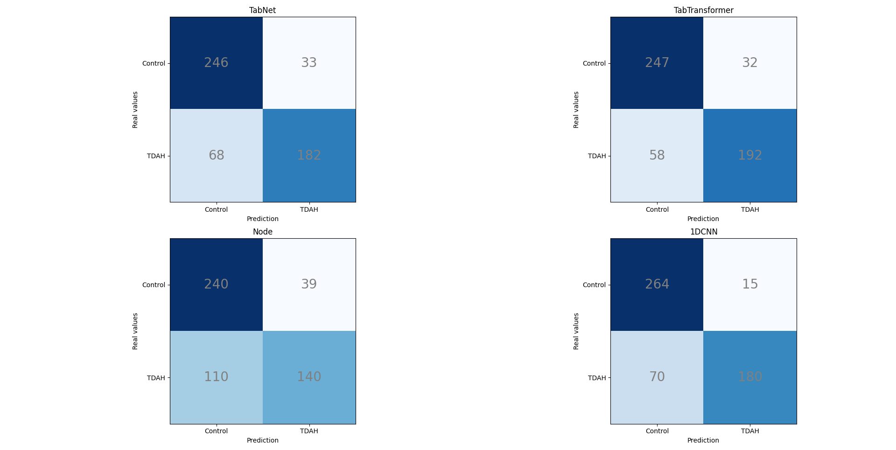
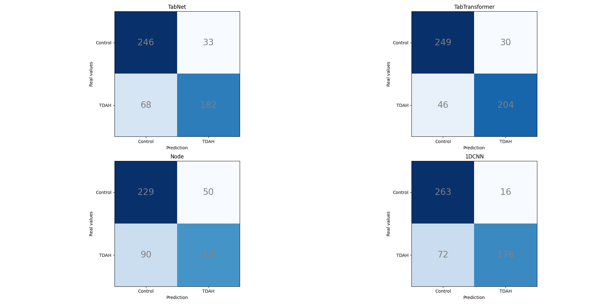

# ADHD Prediction with Neural Networks

## Overview
This study focus on explore, compare and get insights from recent neural networks applied to tabular data, specifically, the models used in this study are: TabNet, TabTransformer, Node and 1DCNN.\
The task to solve is to use this models to predict the possible pressence of ADHD given the scores of a test.\
The dataset used contains samples of 528 individuals from ages of 6-16 years old: 250 of them with positive ADHD diagnosis, and the rest 278 belongs to the group of control.
The samples contains the scores from the different cognitive areas, evaluated with the WMIC test. Some of the features are: Block Design, Digit Span, Picture Concepts, Vocabulary, Verbal Comprehension Index, Working Memory Index...

## Usage
Follow this steps to execute and test the models:

### 1. Install pip libraries
Execute in a terminal the command 'pip install -r requirements.txt' to install the proper versions of libraries.

### 2. Configure main script
Setup the global parameters according to your environment, the hyperparameters of the models, and the information related to your dataset.

### 3. Execute and compare results
Execute the main.py and wait for the results.

## Methodology
To evaluate the models, we have made a comparative study with cross-validation, in a configuration of 10 folds (Stratified K-Fold).

For the metrics used, we calculate: precision, area under ROC curve, sensitivity and specificity.

In order to determine if one model performs better than other, we use the Wilcoxon statistical analysis to know if there is a significance difference between samples.

## Experimentation
For the results, we divide the tests in two groups:
- Models "out-of-the-box" without hyperparameter adjusting, and Standard Scaler Normalization.
- Models "out-of-the-box" without hyperparameter adjusting, and Robust Scaler Normalization.

### Results
We use a configuration of 100 epochs, early stopper of 10, 10-fold cross validation, and seed 1234.

| Model          | Preprocessing | Accuracy | AUC ROC | Recall | Specifity |
|----------------|---------------|----------|---------|--------|-----------|
| TabNet         | Standard      | 80.9     | **86.1**    | 72.8   | 88.2      |
| TabTransformer | Standard      | 83.0     | 82.7    | **76.8**   | 88.5      |
| Node           | Standard      | 71.8     | 71.0    | 56.0   | 86.1      |
| 1DCNN          | Standard      | **83.9**     | 83.3    | 72.0   | **94.6**      |
|----------------|---------------|----------|---------|--------|-----------|
| TabNet         | Robust        | 80.9     | **86.2**    | 72.8   | 88.1      |
| TabTransformer | Robust        | **85.6**     | 85.4    | **81.6**   | 89.3      |
| Node           | Robust        | 73.5     | 73.0    | 64.0   | 82.1      |
| 1DCNN          | Robust        | 83.4     | 82.7    | 71.0   | **94.2**      |

And the confussion matrix:

As we can see in the table above, there is a slighty improvement in performance for some of the models when we use Robust Scaler, with a 8% plus in the case of Node recall, and a 2% in TabTransformer.
This tell us that this models, are more sensitive to the outliers, while TabNet and 1DCNN performs the same.

### Statistical analysis Wilcoxon
With this results, we can perform an statistical analysis using Wilcoxon test, with some variation, because of the multiple comparation between models, we need to introduce an adjustment called, Bonferrini adjust. It just let us control the overall error rate of type I (wrongly discard the null hypothesis).

This are the results of p-values from the test:

| >              | TabNet | TabTransformer | Node | 1DCNN |
|----------------|---------------|----------|---------|--------|
| TabNet         | -      | 1.477     | **0.082**    | 1.125   |
| TabTransformer | 4.705 | -   | **0.006**    | 1.123   |
| Node           | 5.941     | 6     | 71.0    | -  | 5.994      |
| 1DCNN          | 5.033    | 4.877     | **0.012**    | -  |

For the test, we use the AUC ROC metric, and with a significance level of 90% ( $\alpha$ = 0.1 ). This means that any p-value below this 0.1, we can assure that statistically proven, there is evidence to discard the null hypothesis, or in other words, it assures that the model of the row is worst, in terms of ROC metrics, than the model in the column.
So, in this case, we can conclude that in any case, the model NODE performs worst, so we could discard this model with a level of confidence of the 90%.

## Conclusion
In our study we have seen how to use some of the recent implementations of neural networks applied to tabular data in the field of psychological disorders prediction, given a performance of a 85.6% of AUC ROC and let access to tools, that in companion of other types of diagnosis, gives a more deeper analysis and facilitates the diagnosis process.
